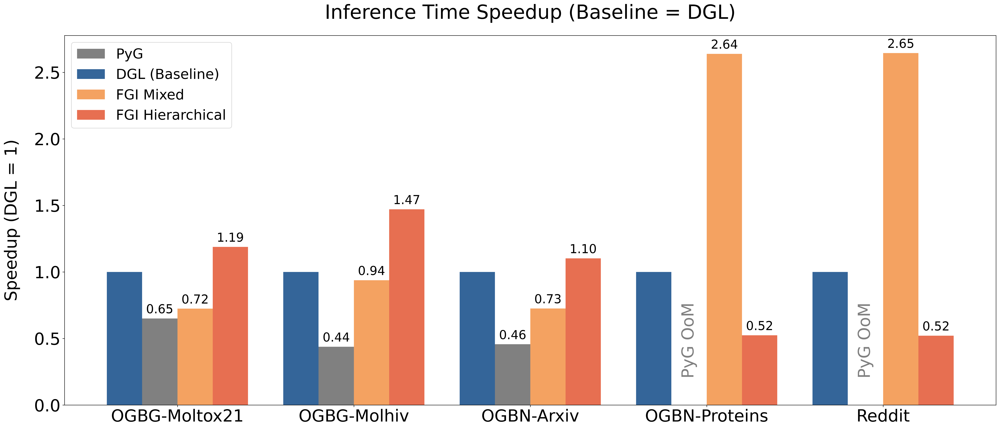

# FGI: Fast GNN Inference on Multi-Core Systems
C code implementation of _FGI: Fast GNN Inference on Multi-Core Systems_ (IPDPSW 2025).

[Binglin Ji](https://keving396.github.io/kevinji.github.io//),
Chenfeng Zhao,
Roger Chamberlain

## Overview
This repository is the official implementation of the **IPDPS Workshops 2025 paper** [_FGI: Fast GNN Inference on Multi-Core Systems_](https://ieeexplore.ieee.org/document/11105982). In this work, we present FGI, a Fast GNN Inference system for large-scale graph data. FGI employs different parallelization strategies, maximizing the utilization of multi-level cache hierarchies in multi-core systems. We evaluate the Graph Convolutional Network (GCN) model with FGI on a 128-core AMD EPYC system. FGI achieves up to 2.64× inference speedup compared to state-of-the-art libraries across five large-scale, high-dimensional graph datasets with different properties.

## Recommended Requirements
### Software Requrements
- OS: Linux Ubuntu >= 16.04,  Rocky Linux >= 9.5
- Software stack dependencies: Pytorch == 2.3.1; DGL == 2.4.0; PyG == 2.6.1; GCC == 11.5.0
- Parallel Computing Tool: OpenMP version 4.5 

### HardWare Requirements
- Multi-core AMD CPUs with multiple Core Complex Dies (CCDs)
- Main Memory >= 8GB

## Code coming soon
